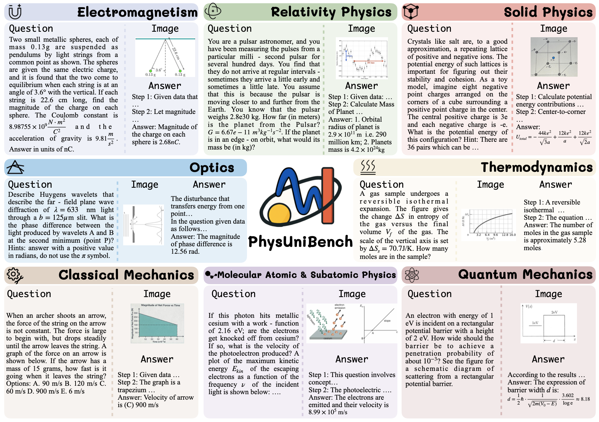

# PhysUniBench

**PHYSUNIBENCH: A MULTI-MODAL PHYSICS REASONING BENCHMARK AT UNDERGRADUATE LEVEL**

PhysUniBench is a large-scale multimodal benchmark specifically designed to evaluate the advanced reasoning capabilities of MLLMs on undergraduate-level physics problems. It offers a diverse set of diagram-paired QA and MCQ physics questions.

---

##  Overview

PhysUniBench includes diverse multimodal physics questions that challenge models in both symbolic and visual reasoning.

---

