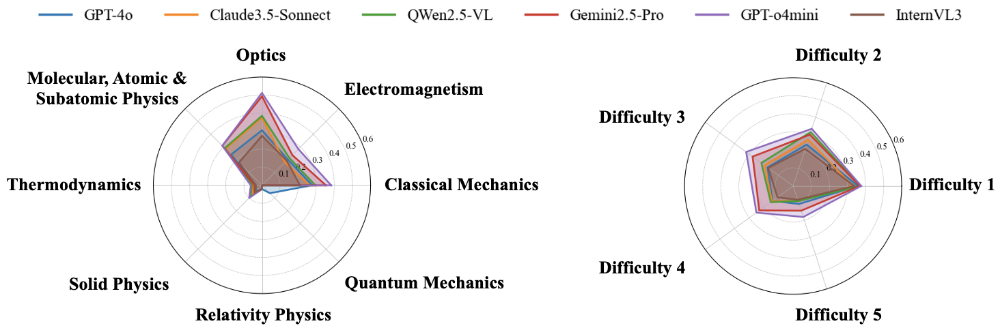

# PhysUniBench

**PhysUniBench: An Undergraduate-Level Physics Reasoning Benchmark for Multimodal Models**

PhysUniBench is a large-scale multimodal benchmark specifically designed to evaluate the advanced reasoning capabilities of MLLMs on undergraduate-level physics problems. It offers a diverse set of diagram-paired QA and MCQ physics questions.

---

##  Overview

PhysUniBench includes diverse multimodal physics questions that challenge models in both symbolic and visual reasoning.

---

##  Subfield Distribution

Covers 8 major subfields of undergraduate physics:

- Electromagnetism (EM)
- Mechanics (ME)
- Thermodynamics (TH)
- Optics (OP)
- Relativity (RE)
- Atomic/Molecular/Subatomic (AMS)
- Quantum Mechanics (QM)
- Solid-State & Measurement (SP)

---

##  Experimental Results

### Radar Accuracy Chart

---

###  Accuracy by Subfield (MCQ & QA)

**Abbreviations:**  
OP = Optics, AMS = Atomic/Molecular/Subatomic, ME = Mechanics, SP = Solid Physics,  
TH = Thermodynamics, EM = Electromagnetism, RE = Relativity, QM = Quantum Mechanics

### MCQ Accuracy by Subfield (%)

| Model                | Overall | OP   | AMS  | ME   | SP   | TH   | EM   | RE   | QM   |
|---------------------|---------|------|------|------|------|------|------|------|------|
| GPT-4o              | 33.7    | 42.9 | 39.2 | 40.1 | **33.3** | *32.8* | 35.4 | *41.2* | *36.2* |
| Claude-3.5-Sonnet   | *36.5*  | *43.2* | *50.9* | *41.3* | *32.1* | **44.0** | *35.8* | **45.5** | **44.9** |
| Qwen2.5-VL-72B      | 33.4    | 31.9 | 32.9 | 40.8 | 23.9 | 26.9 | 29.8 | 38.3 | 33.9 |
| Gemini-2.5-Pro      | 26.5    | 27.8 | 29.7 | 26.6 | 25.5 | 25.0 | 24.7 | 24.3 | 35.9 |
| GPT-o4-mini         | **36.7**| **57.9** | **55.3** | **42.1** | 31.2 | 24.7 | **41.2** | 30.9 | 35.9 |
| InternVL-3-38B      | 33.6    | 41.3 | 41.9 | 37.6 | 21.6 | 26.6 | 29.2 | 12.1 | 32.1 |

### OEQ Accuracy by Subfield (%)

| Model                | Overall | OP   | AMS  | ME   | SP   | TH   | EM   | RE   | QM   |
|---------------------|---------|------|------|------|------|------|------|------|------|
| GPT-4o              | 20.9    | 30.5 | 24.1 | 27.8 | 5.0  | 3.4  | 20.2 | 2.1  | **6.2** |
| Claude-3.5-Sonnet   | 19.0    | 37.6 | 28.5 | 26.2 | 8.0  | 4.8  | 17.9 | 2.1  | 0.0 |
| Qwen2.5-VL-72B      | 23.7    | 38.5 | 29.1 | 29.5 | *9.0* | *5.5* | 21.4 | 2.1  | 0.0 |
| Gemini-2.5-Pro      | *25.5*  | *49.3* | *31.0* | *35.2* | 6.0  | 4.1  | *23.7* | 2.1  | 0.0 |
| GPT-o4-mini         | **26.5**| **51.2** | **31.0** | **38.2** | **10.0** | **6.2** | **28.4** | 2.1 | 0.0 |
| InternVL-3-38B      | 17.7    | 27.4 | 17.9 | 21.0 | 5.5  | 3.4  | 19.3 | 2.1  | 0.0 |

*Bold = highest; Italic = second-highest*

---

###  Accuracy by Difficulty Level

| Model              | L1-MCQs | L1-QAs | L2-MCQs | L2-QAs | L3-MCQs | L3-QAs | L4-MCQs | L4-QAs | L5-MCQs | L5-QAs |
|-------------------|---------|--------|---------|--------|---------|--------|---------|--------|---------|--------|
| GPT-4o            | 54.7    | 35.8   | 41.2    | 24.1   | *36.1*  | 17.5   | 31.6    | 14.1   | 27.1    | 10.5   |
| Claude-3.5-Sonnet | *54.9*  | 32.9   | **48.8**| 27.0   | 33.3    | 19.5   | *36.5*  | 14.4   | *36.5*  | 8.8    |
| Qwen2.5-VL-72B    | **60.5**| *37.0* | 45.1    | *31.4* | 31.6    | 21.7   | 16.8    | 15.3   | 12.3    | 8.8    |
| Gemini-2.5-Pro    | 23.2    | 36.8   | 21.6    | 29.9   | 23.7    | *27.7* | 29.6    | *23.1* | 34.3    | *14.4* |
| GPT-o4-mini       | 49.7    | **37.5**| *47.2*  | **33.3**| **40.5**| **32.1**| **36.8**| **25.1**| **37.5**| **18.0** |
| InternVL-3-38B    | 49.2    | 33.7   | 34.8    | 21.6   | 32.1    | 17.0   | 27.2    | 10.7   | 24.2    | 8.0    |

---

